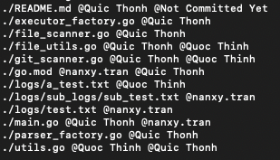
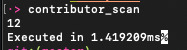

# Git owner generator 🔎
Auto generate output contains file paths and owners of that files (copy paste to your repo without reformat). 
Maximum 2 owners per file, specific number is under working :wink

## Installation <br /> 
*Make sure you have installed GO 1.18 on your machine and export the path as well*
If not, add this line to your `zsh_rc` or `bash_rc`
```
export PATH=$PATH:$HOME/go/bin
```
### Install locally
```shell
git clone https://github.com/Nanxy-Tran/contributor_scan.git  
cd contributor_scan
go install
```

### Install globally
Make sure you et your **GOPATH** in `zshrc`, `bash_rc`, etc,..
```shell
go install github.com/nanxy-tran/contributor_scan@latest
```
  
## Usage
At your desired directory, to retrieve git owner output, run: <br>
```
contributor_scan git
```

To retrieve number of files, run: <br>
```
contributor_scan
```

Retrieve number of lines, run: <br>
```
contributor_scan line
```

## Examples 
Git generated output for Github owners: <br>



Total file count: <br>




## Support if you like!
Please ⭐️ this repository if this project helped you!
